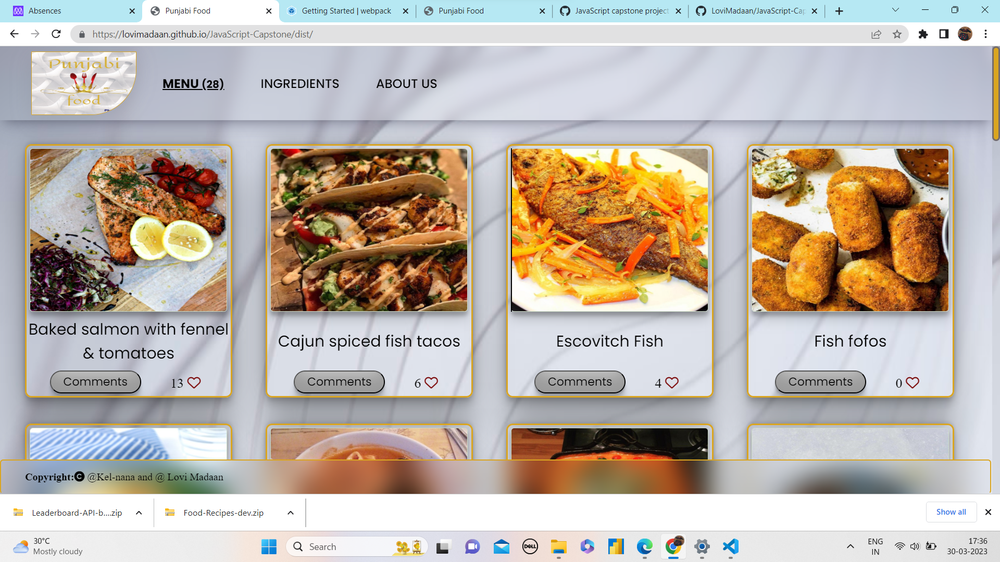
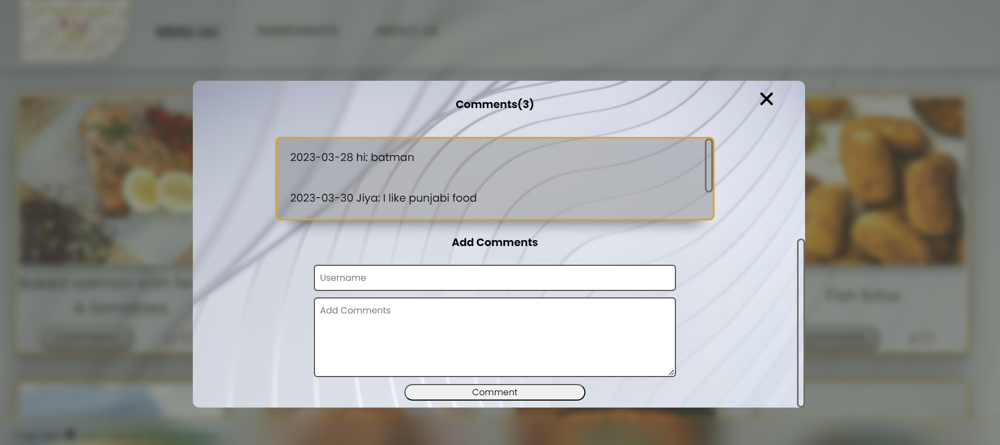

<a name="readme-top"></a>

<div align="center">
  
  
  <br/>

  <h3><b>Food Recipes</b></h3>

</div>

# 📗 Table of Contents

- [📖 About the Project](#about-project)
  - [🛠 Built With](#built-with)
    - [Tech Stack](#tech-stack)
    - [Key Features](#key-features)
- [🚀 Live Demo](#live-demo)
- [🔭 Watch video](#watch-video)
- [💻 Getting Started](#getting-started)
  - [Prerequisites](#prerequisites)
  - [Setup](#setup)
  - [Install](#install)
  - [Usage](#usage)
  - [Run tests](#run-tests)
  - [Deployment](#triangular_flag_on_post-deployment)
- [👥 Authors](#authors)
- [🔭 Future Features](#future-features)
- [🤝 Contributing](#contributing)
- [⭐️ Show your support](#support)
- [🙏 Acknowledgements](#acknowledgements)
- [📝 License](#license)

# 📖 Food Recipes <a name="about-project"></a>

**Food Recipes** is a simple project that display sea-foods from [TheMealDb](https://www.themealdb.com/api.php) Api. The user can like, comment and look the description of each foods.

## Project view:
> Home page view



> Comment popup view



## 🛠 Built With <a name="built-with"></a>

### Tech Stack <a name="tech-stack"></a>

- **HTML, CSS, and JavaScript, Api, Webpack, Jest**

### Key Features <a name="key-features"></a>

- **html styled with css and javascript**
- **uses webpack**
- **uses Api**

<p align="right">(<a href="#readme-top">back to top</a>)</p>

## 🚀 Live Demo <a name="live-demo"> </a>

> Check out the live demo for this project [here.](https://lovimadaan.github.io/JavaScript-Capstone/dist/)

<p align="right">(<a href="#readme-top">back to top</a>)</p>


## 🔭 Watch Video <a name="watch-video"> </a>

> Check out the video for this project [Coming Soon..]()

<p align="right">(<a href="#readme-top">back to top</a>)</p>


## 💻 Getting Started <a name="getting-started"></a>

To get a local copy up and running, follow these steps.


### Prerequisites

In order to run this project you need:
```sh
A Computer (MAC or PC)
Code editor (VSCode,Atom etc...)
A browser (Chrome,Mozilla,Safari etc...)
Version Control System (Git and Github)
NodeJS (https://nodejs.org/en/)
```
### Setup

Clone this repository to your desired folder:
```sh
cd my-folder
git clone  https://github.com/LoviMadaan/JavaScript-Capstone.git
```
### Install

Install this project with:

```sh
npm install
```

### Usage
```sh
npm run build
npm start
```


### Run tests

To run, run the following command:
```sh
npm test
```
### Deployment

You can deploy this project using:
```sh
Github Pages
```

<p align="right">(<a href="#readme-top">back to top</a>)</p>

<!-- AUTHORS -->
## 👥 Authors <a name="authors"></a>

👤 **Kelvin Irungu**

- GitHub: [@Kel-nana](https://github.com/Kel-nana)
- Linkedin: [@kelvin-irungu](https://www.linkedin.com/in/kelvin-irungu-838923249/)
- Twitter: [@kelvin-irungu](https://twitter.com/home)

<p align="right">(<a href="#readme-top">back to top</a>)</p>

## 👥 Authors <a name="Lovi MAdaan"></a>

👤 **Lovi Madaan**

- GitHub: [LoviMadaan](https://github.com/LoviMadaan)
- Twitter: [@lovinarang](https://twitter.com/lovinarang)
- LinkedIn: [LoviMadaan]https://www.linkedin.com/in/lovi-madaan-b27439175

<p align="right">(<a href="#readme-top">back to top</a>)</p>

## 🔭 Future Features <a name="future-features"></a>

- [ ] **Add more meal categories**
- [ ] **Adding some backend features**
- [ ] **Mobile version of the page will be added**

<p align="right">(<a href="#readme-top">back to top</a>)</p>

## 🤝 Contributing <a name="contributing"></a>

Contributions, [issues](https://github.com/fuadmoin/Food-Recipes/issues), and feature requests are welcome!

<p align="right">(<a href="#readme-top">back to top</a>)</p>

## ⭐️ Show your support <a name="support"></a>

If you like this project please consider starring it.

<p align="right">(<a href="#readme-top">back to top</a>)</p>

## 🙏 Acknowledgments <a name="acknowledgements"></a>

We would like to thank [Microverse](www.microverse.com) and [TheMealDb](https://www.themealdb.com/api.php) Api


<p align="right">(<a href="#readme-top">back to top</a>)</p>

## 📝 License <a name="license"></a>

This project is [MIT](./MIT.md) licensed.

<p align="right">(<a href="#readme-top">back to top</a>)</p>
